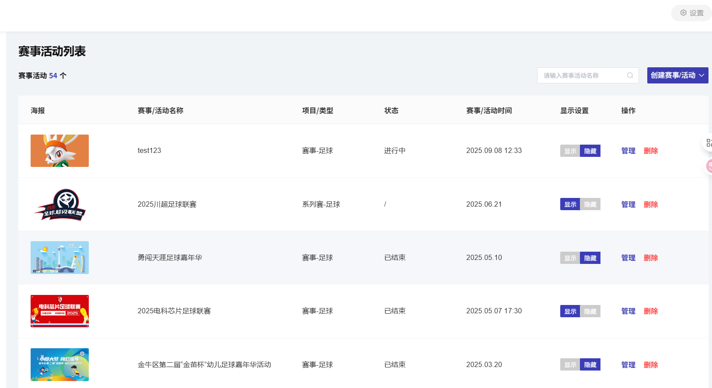
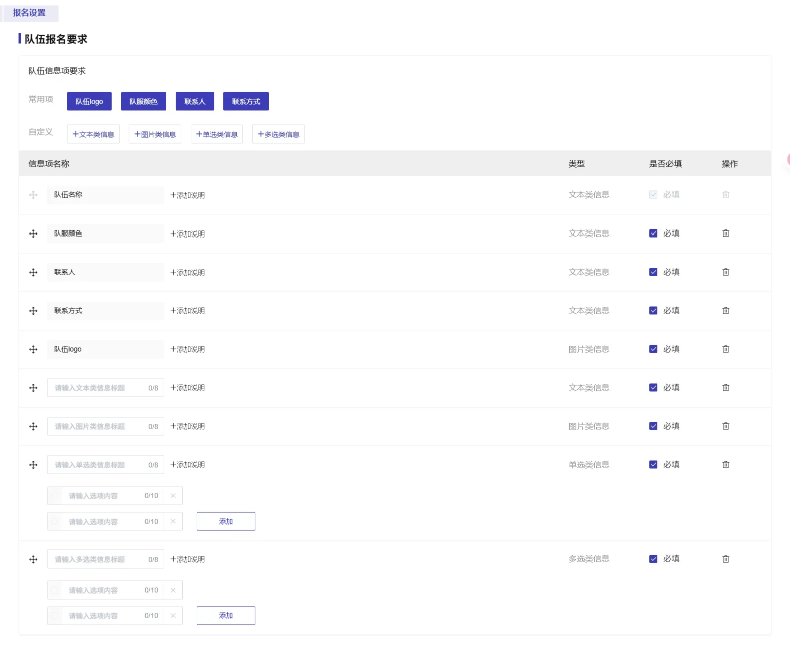

# web-报名系统管理端

报名系统概览

本系统是一个基于 Next.js + Supabase 的网络报名平台，旨在为体育比赛提供便捷的线上报名与管理。系统分为 **报名端**（微信小程序端，教练和家长使用）和 **管理端**（web端，管理员使用）两部分。教练负责主导报名流程，家长协助完善参赛者信息，管理员审核报名并管理比赛发布及成绩录入。整体流程确保每位学生的报名信息由其负责教练提交，由管理员审核通过，最终录入报名系统。

主要角色及职责：

-   **教练**：注册/登录后，添加并管理自己所负责学生的报名信息，邀请学生家长补充资料，查询所带学生的参赛成绩等。
    
-   **家长**：通过教练邀请注册/登录后，填写孩子的个人资料和证件照片。
    
-   **管理员**：登录后审核所有报名申请，创建和发布比赛信息（比赛项目列表等），对系统内各项数据进行管理。
    

该系统采用 Next.js 前端框架开发，利用 Supabase 提供的身份认证、数据库和文件存储服务，暂时部署在本地，后续可部署到阿里云服务器。

# 管理端

我需要开发一个用于学生报名比赛的系统，本次任务只用开发web管理端应用，web管理端只是管理员使用。

基于plan.md和CLAUDE.md进行开发，合理使用Context7 mcp从官方源（如文档站点、GitHub 仓库）实时提取最新的、特定版本的文档和代码示例

## 1、登录页面

- 进入前进入#登录页面#，无需注册页面，管理端自行设定账号密码进行登录，通过手机号和密码登录。

## 2、主页面：赛事活动列表

- 登录后直接进入#主页面：赛事活动列表#（如图1）
- 显示的赛事活动列表（如下图1）均由#创建赛事-1级子页面#创建
    
    显示列为：海报（图片）-名称-类型-状态-时间-显示设置（显示/隐藏）-操作（管理/删除），接下来依次说明。
    

图 1

- 海报（图片）/名称/类型/时间，均显示#创建赛事-1级子页面#管理员手动创建内容
- 状态
    
    现在处于设置的赛事时间内则显示“进行中”，现在已经过了设置的赛事时间则显示“已结束”
    
- 显示设置
    
    点击#显示#按钮后报名端列表可见，点击后管理端#显示#按钮高亮；点击#隐藏#后报名端列表不可见，管理端#隐藏#按钮高亮，如下图2和图3
    
    
    
    图 2
    
    
    
    图 3
    
- 操作
    
    点击#管理#按钮（见图1最右列）进入#信息管理-2级子页面#（下图7、图8、图9）
    
    点击#删除#按钮后删除所有赛事信息（见图1最右列），管理端及报名端没有此赛事的信息，删除前要提醒（见下图4 ）
    
    
    
    图 4
    
- 搜索框及创建赛事
    
    #主页面：赛事活动列表#右上角搜索框（如图1 右上角“请输入赛事活动名称”）可输入名称关键词进行搜索，预填“请输入赛事活动名称”
    
    点击#主页面：赛事活动列表#右上角#创建赛事#按钮（见下图5）后进入#创建赛事-1级子页面#（见下图7、图8、图9）
    

图 5

- #主页面：赛事活动列表#最顶部有设置按钮（见图1最右上角），可点击#退出登录#按钮见下图6）回到登录页面，不需要修改密码功能，直接删除（见下图6）

图 6

## 3、创建赛事-1级子页面

点击#主页面：赛事活动列表#右上角的#创建赛事#按钮（上图5）进入#创建赛事-1级子页面#（上图5，下图7、图8、图9）

创建赛事信息如下（见下图7、图 8）

- 赛事名称
    
    输入文本
    
- 赛事简称
    
    输入文本
    
- 赛事海报
    
    上传附件（图片）
    
- 赛事类型
    
    备选框（足球、篮球、排球、自定义…）
    
- 赛事活动功能
    
    不保留，删除此功能区
    
- 赛事开始时间
    
    日期选择
    
- 赛事结束时间
    
    日期选择
    
- 赛事地址
    
    输入文本
    
- 赛事详情
    
    输入长文本，可实现加粗、字号调整、字体、斜体、图片上传、对齐功能
    
- 咨询电话
    
    输入数字
    

点击#创建#按钮（见图9）后进入#信息管理-2级子页面#（见图10）

图 7

图 8

图 9

## 4、信息管理-2级子页面

点击#创建#按钮（见图9）后进入#信息管理-2级子页面#（见图10）

### 左侧1：基本信息

点击#基本信息#按钮后，内容与#创建赛事-1级子页面#一致，#创建#按钮改为#保存#按钮(见下图10)，修改基本信息后点击#保存#按钮即可修改（见下图10图11）

ps:图10左上角图片为#创建赛事-1级子页面#设置的赛事海报

图 10

图 11

### 左侧2：报名管理

报名管理分为：#报名列表#、#审核列表#、#报名设置#三个部分见下图 12；

管理员首先需要在点击#报名管理#下的#报名设置#设置报名端需填写的报名内容，报名设置保存后，报名端即可进行报名，在报名端完成填写后报名信息并点击提交后会出现在#审核列表#中，管理员进行审核，审核通过后，报名端显示“已报名”，管理端报名信息进入#报名列表#完成报名，审核不通过，管理员填写驳回理由确认驳回后报名端显示“已驳回”并将报名信息移除#审核列表#。下面依次描述功能

**一、报名设置**

用于设置队伍报名及人员报名要求（如图12）

图12

**1、队伍报名要求** （见下图13）

- 常用项包括队伍logo（上传图片）、队伍名称（上传文本）、联系人（上传文本）、联系方式（上传文本）。额外增加“报名校区”（上传文本），“报名校区”默认必填
- 自定义项包括文本类信息（可自定义文本标题，填写文本内容）、图片类信息（可自定义文本标题，上传图片）、单选信息（自定义单选标题，自定义选项内容）、多选信息（自定义多选标题，自定义选项内容）
- 常用项及自定义项均可由管理员自由添加或删除（除报名校区），也都可自由选择是否必填。
    
    
    
    图13
    

**2、人员报名要求** （见下图14）

- 常用项及自定义项如下图14，可参考#队伍报名要求#，但要注意需设置队员性别、年龄、人数的要求（见下图14）；人员报名要求可以添加不同角色，不同角色的信息项要求同队员要求。下图14中的报名费用和小程序报名显示设置删除。其他不变保持如图。
    
    
    
    图14
    

**二、审核列表** （见下图15）

- 报名端填写由报名设置的内容后进入#审核列表#，管理员可点击对应队伍#审核#按钮（见下图15），可预览队伍信息及队员信息（见下图16），管理员点击#驳回#按钮（见下图16，点击后要让管理员确认是否驳回，并填写驳回理由（见下图20））后报名端显示“已驳回”，需教练修改后再次提交重新进入“审核列表”，点击#通过#后，报名信息进入#报名列表#（见下图17）

图15

图16

图20

**三、报名列表** 

- 显示#审核列表#中通过的报名队伍信息，可点击对应队伍的#查看#按钮（见下图17）查看对应报名队伍填写的信息（见下图18，信息是由之前#创建赛事-1级子页面#设置的），点击#驳回#按钮（功能同#审核列表#的#驳回#按钮）（见下图17）
- 可点击右上角#添加报名#按钮（见下图17），管理员可手动添加报名信息（内容为#创建赛事-1级子页面#所设置内容）（见下图19）
- 选择对应队伍，点击#下载#按钮（见下图17）可下载教练填写的报名信息

图17

图18

图19

### 左侧：赛程管理/下载任务列表取消，不用设置