# web-报名端

# 报名系统概览

本系统是一个基于 Next.js + Supabase 的网络报名平台，旨在为体育比赛提供便捷的线上报名与管理。系统分为 **报名端**（web端，教练和家长使用）和 **管理端**（web端，管理员使用）两部分。教练负责主导报名流程，家长协助完善参赛者信息，管理员审核报名并管理比赛发布及成绩录入。整体流程确保每位学生的报名信息由其负责教练提交，由管理员审核通过，最终录入报名系统。

主要角色及职责：

- **教练**：注册/登录后，添加并管理自己所负责学生的报名信息，邀请学生家长补充资料，查询所带学生的参赛成绩等。
- **家长**：通过教练的分享链接填写队员的个人资料和证件照片等比赛信息（无需注册）
- **管理员**：登录后审核所有报名申请，创建和发布比赛信息（比赛项目列表等），对系统内各项数据进行管理。

# 登录注册页面

#登录注册页面# 与管理端共用一个登录页面，共享一套 Auth，登录后按角色自动分流到不同的主页，新增注册页面以供报名端注册（通过注册的账号默认进入报名端）， 使用Supabase的邮箱号码登录注册方案，我已经设置好了custom SMTP，登录后进入报名端的#主页#，图1为管理端登录页面

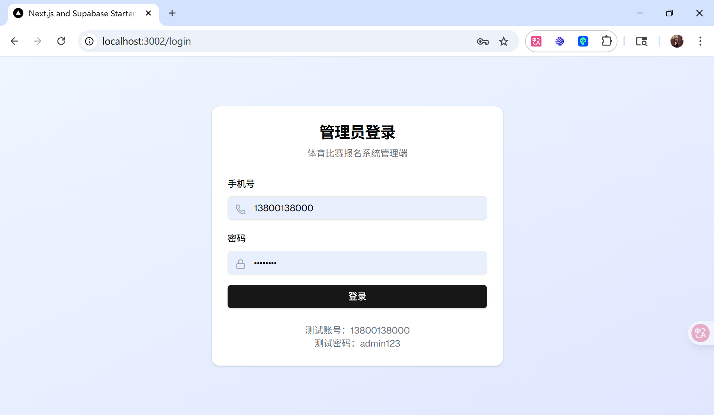

图1 

# 主页

**教练登录后进入报名端#主页#**

- #主页#左侧有一个菜单导航栏（类似图2的左侧菜单栏），只有#赛事活动#和#我的#两个按钮，进入主页时右侧页面默认显示#赛事活动#内容；
- 点击#赛事活动#右侧显示#赛事活动#内容；
- 点击#我的#按钮右侧显示，导航栏显示#我的报名#和#我的通知#两个子导航，再次点击则隐藏两个子导航，默认下显示两个子导航（参考下图2布局）；
- 左侧菜单导航栏的最底端有展开导航栏（关闭时）和关闭导航栏（展开时）的icon，默认下导航栏是展开的。

图2

## 赛事活动-导航栏

**点击#主页#左侧菜单导航栏的“赛事活动”按钮后右侧显示#赛事活动#内容（类似上图2右侧的展示方式）**

注：下述要求显示的信息均来自于报名系统的管理端设置的赛事信息，在开发管理端用的数据库为final-fix.sql我已导入supabase，final-fix.sql地址为：D:\cursor\system\with-supabase-app\final-fix.sql 可自由查看，若需要我更新数据库结构可要求我导入新的.sql到 supabase。

- #主页#右侧的#赛事活动#内容中，顶部的左侧为“赛事活动”标题（类似下图3左上角“赛事活动管理”标题），顶部的右侧有搜索导航栏预填“请输入赛事名称”（见下图3右上角，删除#创建赛事#按钮），最右侧有#设置#按钮，点击后可退出登录返回#登录注册页面# （见下图3）
- #主页#右侧的#赛事活动#内容中，以列表形式显示管理端创建的各项赛事（见下图3排布形式）；
- 每行赛事的最左侧是管理端设置的海报图片显示预览（类似下图3的最右列，但不需要显示“海报”字样的表头）；然后依次显示：名称、类型、状态、时间（具体内容来自管理端，需要显示表头）；
- 每行最右侧列显示“去报名”或“已完结”，不需要显示表头，如果报名端用户的时间处于管理端报名时间内则最右侧显示#去报名#按钮，如果报名端用户的时间超过管理端报名时间则最右侧显示#已完结#按钮；
- 如管理端主页的显示设置为“显示”（见下图3第 6 列）则#赛事活动#以按照以上要求正常显示管理端的赛事，如管理端主页的显示设置为“隐藏”（见下图3第 6 列）则#赛事活动#不显示该赛事；
- 点击整行或#去报名#按钮进入该赛事的#详情#页面；
- 点击#已完结#，弹窗提示用户该比赛已结束。

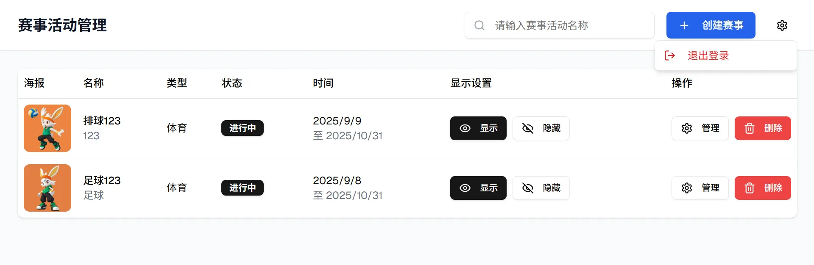

图3

### 详情-2级子页面

**点击#赛事活动#中某赛事的整行或#去报名#按钮进入该赛事的#详情#页面**

注1：下述要求显示的信息均来自于报名系统的管理端设置的赛事信息，在开发管理端用的数据库为final-fix.sql我已导入supabase，final-fix.sql地址为：D:\cursor\system\with-supabase-app\final-fix.sql 可自由查看，若需要我更新数据库结构可要求我导入新的.sql到 supabase。

注2：参考图为微信小程序页面，要调整为适合web端的展现方式。

- #详情#页面要有来自管理端的赛事海报作为该赛事的专属标识，醒目显示赛事名称、赛事状态以及赛事类型（可参考下图 4 小程序界面顶部，需要适配为 web 端）；
- 取消#分享#按钮；
- 包含时间、咨询电话、地址、详情内容（以上内容均来自于管理端管理员设置内容），可参考下图 4 小程序界面中间段，删除报名队伍数，改为咨询电话（直接显示管理端设置的电话号码），取消旁边的“报名详情”按钮
- 我的报名显示报名状况，包含队伍标题和已报名或驳回或已取消三种状态，管理端审核通过则显示已报名，管理端驳回则显示驳回，报名端自行取消后已取消；
- 设置#报名#按钮，点击#报名#按钮后进入#报名#-3 级子页面（可参考下图4小程序底端）

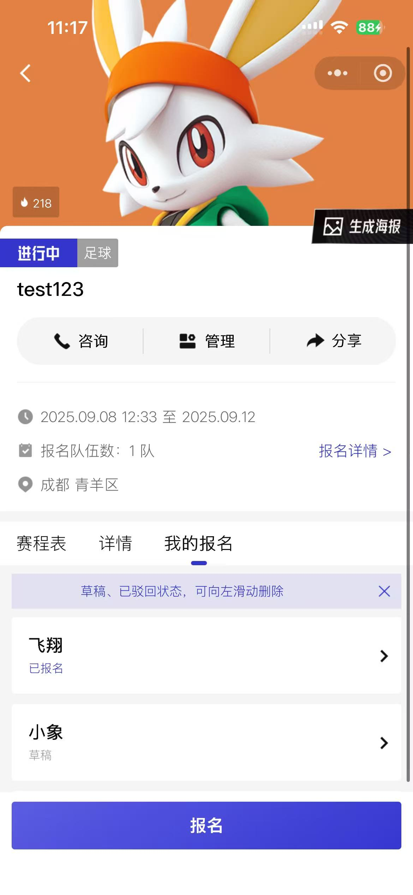

图4

### **报名-3级子页面**

**点击#详情#页面中的#报名#按钮后进入#报名# -3 级子页面**

注1：下述要求显示的信息均来自于报名系统的管理端设置的赛事信息，在开发管理端用的数据库为final-fix.sql我已导入supabase，final-fix.sql地址为：D:\cursor\system\with-supabase-app\final-fix.sql 可自由查看，若需要我更新数据库结构可要求我导入新的.sql到 supabase。

注2：参考图为微信小程序页面，要调整为适合web端的展现方式。

- 要显示“队伍”信息填报部分（类似下图5上半部分），要求用户填写字段来自管理端的#报名设置#的“队伍报名要求”；
- 显示“队员”信息填报部分（类似下图5下半部分），点击#添加队员#进入#队员信息#页面完成填写队员信息；添加队员数量限制来自“人员报名要求”的“人员要求”；要求填写字段来自管理端的#报名设置#的“队伍报名要求”；
- “队员”信息填报部分要有#分享给队员填写#的按钮，点击后显示“已复制填写链接”，用户则复制到#专属队员填报链接#，通过该链接后可进入用户创建的队伍#队员信息填报#页面（通过#专属队员填报链接#进入不需要登录）；
- 完成填写后可以选择点击#提交报名#按钮确认报名，填写信息上传到管理端的审核列表，返回#详情#页面#我的报名#下显示“已报名”状态（见上图4）；已报名状态下最右侧有删除按钮，点击后显示“已报名队伍无法shan'c”
- 完成填写后可点击#暂存为草稿#按钮，存为草稿不进行上传，保留所填写的信息，填写信息后退出#报名#页面后也自动保存已填写的信息，存为草稿不进行上传，返回#详情#页面#我的报名#下显示“草稿”（见上图4）。草稿状态下最右侧有删除按钮，点击后可删除此条信息。

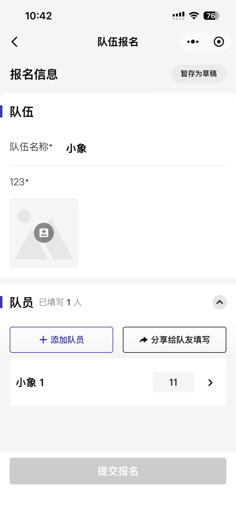

图5

### 队员信息-4**级子页面**

注1：下述要求显示的信息均来自于报名系统的管理端设置的赛事信息，在开发管理端用的数据库为final-fix.sql我已导入supabase，final-fix.sql地址为：D:\cursor\system\with-supabase-app\final-fix.sql 可自由查看，若需要我更新数据库结构可要求我导入新的.sql到 supabase。

注2：参考图为微信小程序页面，要调整为适合web端的展现方式。

**在报名页面点击#添加队员#按钮或通过#专属队员填报链接#进入#队员信息填报#页面（参考下图），通过#专属队员填报链接#进入#队员信息填报#不需要注册登录**

- 填写的内容来自管理端的#报名设置#的“人员报名要求”；
- 点击“保存”按钮后保存填写数据，返回#报名#页面，并在#报名#页面的队员部分显示刚刚填写的队员预览（参考上图5下半部分）；
- 每个队员信息要有#删除#按钮，点击按钮后可以删除该队员（见下图6）；
- 点击#保存#按钮后保存所填写信息，并返回#报名-3级子页面#，#报名-3级子页面#队员部分显示刚刚填写队员信息的预览行（见上图5）。

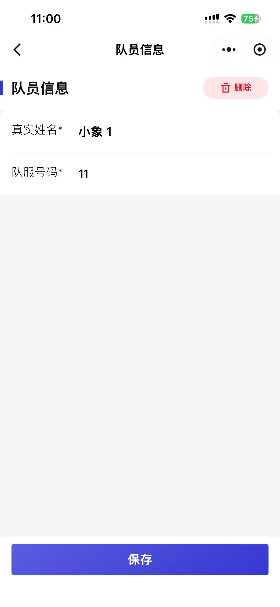

图6

## 我的-导航栏

点击#主页#左侧菜单导航栏的“我的”按钮后右侧显示#我的#内容（类似上图2左右侧的展示方式）

注1：下述要求显示的信息均来自于报名系统的管理端设置的赛事信息，在开发管理端用的数据库为final-fix.sql我已导入supabase，final-fix.sql地址为：D:\cursor\system\with-supabase-app\final-fix.sql 可自由查看，若需要我更新数据库结构可要求我导入新的.sql到 supabase。

- 在左侧的导航菜单栏的#我的#按钮下制作#我的报名#和#我的通知#两个子导航（参考上图2布局）
- 点击#我的#按钮可选择隐藏和展开#我的报名#和#我的通知#两个子导航菜单栏，默认下展开（上图2布局下设置#我的#的子导航子导航菜单栏）
- 点击#我的报名#按钮后右侧显示#我的报名#内容（类似上图2左右侧的展示方式）
- 点击#我的通知#按钮后右侧显示#我的通知#内容（类似上图2左右侧的展示方式）

### 我的通知-1级子页面

点击#我的通知#按钮后右侧显示#我的通知#内容（类似上图2左右侧的展示方式）

注1：下述要求显示的信息均来自于报名系统的管理端设置的赛事信息，在开发管理端用的数据库为final-fix.sql我已导入supabase，final-fix.sql地址为：D:\cursor\system\with-supabase-app\final-fix.sql 可自由查看，若需要我更新数据库结构可要求我导入新的.sql到 supabase。

注2：参考图为微信小程序页面，要调整为适合web端的展现方式。

- #主页#右侧的#我的通知#内容中，顶部的左侧为“我的通知”标题（类似上图3左上角“赛事活动管理”标题），顶部的右侧有搜索导航栏预填“请输入赛事名称”（见上图3右上角，删除#创建赛事#按钮），最右侧有#设置#按钮，点击后可退出登录返回#登录注册页面# （见上图3）
- #主页#右侧的#我的通知#内容中显示管理端的审核通知或报名通知，审核报名通知均来自管理端的报名（可参考下图7）；
- 对于未读消息标记提示红点（可参考下图7），存在未读消息时，#我的通知#显示未读消息条数（可参考下图8）
- 取消#全部已读#按钮；
- 点击“报名通知”或“审核通知”整行，进入#通知详情#页。

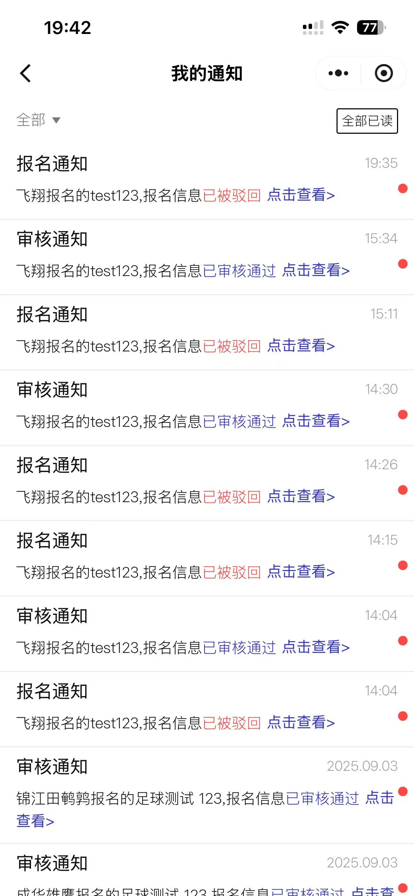

图7

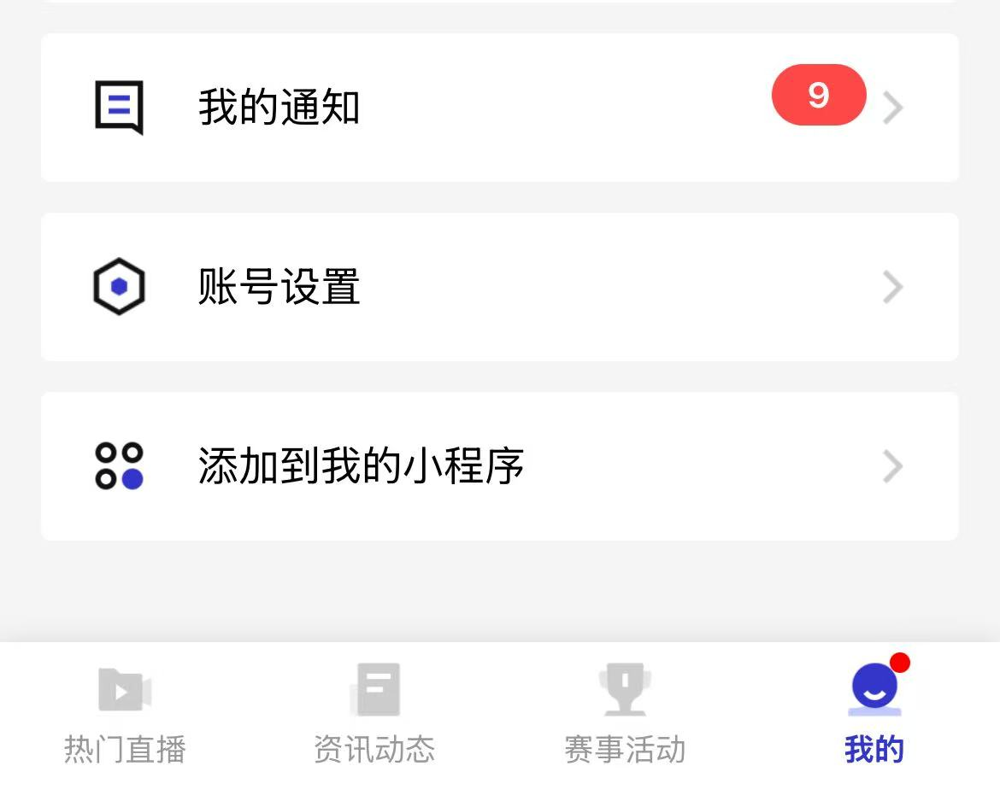

图8

### 通知详情-2级子页面

点击#我的通知#页面中的“报名通知”或“审核通知”整行，进入#通知详情#页。

注1：下述要求显示的信息均来自于报名系统的管理端设置的赛事信息，在开发管理端用的数据库为final-fix.sql我已导入supabase，final-fix.sql地址为：D:\cursor\system\with-supabase-app\final-fix.sql 可自由查看，若需要我更新数据库结构可要求我导入新的.sql到 supabase。

注2：参考图为微信小程序页面，要调整为适合web端的展现方式。

- 管理端的审核列表通过，则显示为“审核通知”开头的信息（参考上图7），点击进入后显示赛事信息和报名信息（参考下图8图9）。
- 管理端的审核列表通过，要设置#取消报名#按钮（参考下图8），在报名截止前均可取消报名并再次提交信息，点击取消报名后管理端的报名列表显示“用户取消报名”，点击取消报名后保留填写的报名信息，#报名-3级子页面#的报名状态显示为“已取消”，用户可在“已取消”此状态下继续增删改查并再次提交（报名时间前均可再次提交）。
- 管理端或报名列表驳回，要显示“报名通知”开头的信息（参考上图7），点击进入后显示赛事信息和报名信息（参考下图10图11），要展示管理端的驳回理由、赛事信息和报名信息（参考下图10图11）
- 管理端或报名列表驳回，要设置#提交报名#按钮（参考下图10图11），在报名时间结束前均可在此状态下再次提交信息，用户可点击此状态下继续增删改查并再次提交。

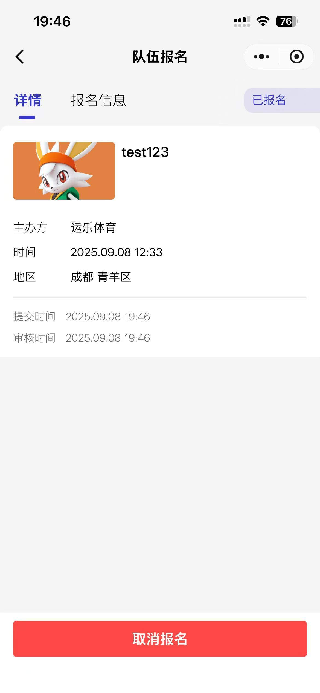

图8

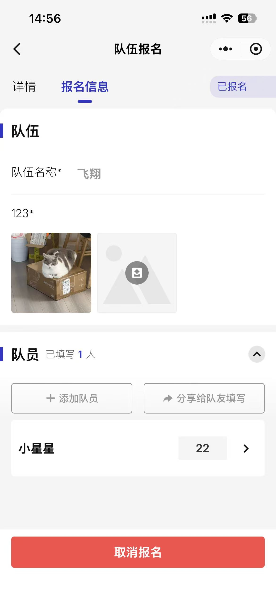

图9

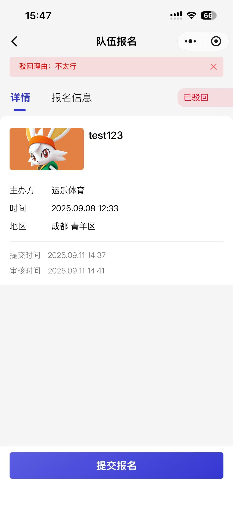

图10

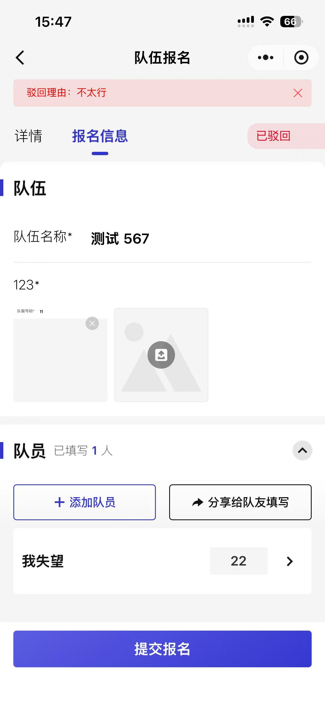

图11

### 我的报名-1级子页面

注1：下述要求显示的信息均来自于报名系统的管理端设置的赛事信息，在开发管理端用的数据库为final-fix.sql我已导入supabase，final-fix.sql地址为：D:\cursor\system\with-supabase-app\final-fix.sql 可自由查看，若需要我更新数据库结构可要求我导入新的.sql到 supabase。

注2：参考图为微信小程序页面，要调整为适合web端的展现方式。

- 点击#我的信息#按钮后右侧显示#我的信息#内容（类似上图2左右侧的展示方式），，#主页#右侧的#我的报名#内容中，顶部的左侧为“我的报名”标题（类似上图3左上角“赛事活动管理”标题），顶部的右侧有搜索导航栏预填“请输入赛事名称”（见上图3右上角，删除#创建赛事#按钮），有#筛选#的按钮点击后下拉选项有：全部、草稿、带审核、已报名、已驳回、已取消六种状态，默认展示全部内容，最右侧有#设置#按钮，点击后可退出登录返回#登录注册页面# （见上图3）
- 内容显示各个状态下的报名信息（可参考下图12）

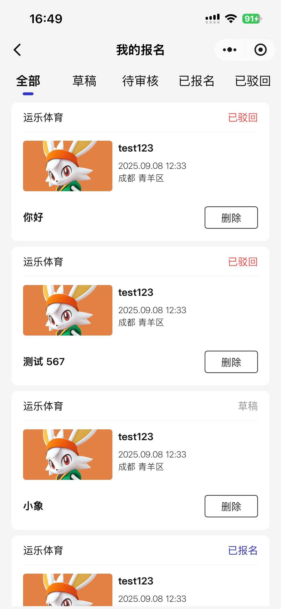

图12